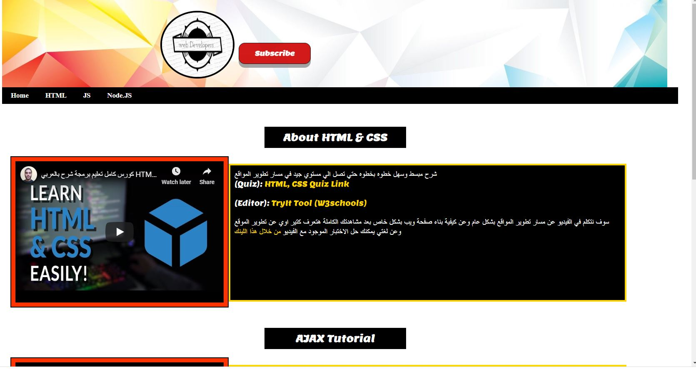

# responsive-design2
full responsive design, but this time using HTML5 youtube to add my own youtube videos on my offline website, it can work while it offline (no server), I used HTML5, HTML5 youtube, CSS3,  mailto, media query, I did it less than 4 hours

## please note I'm using inline css to make it open fast after downloading and save space and to be able to use HTML pasta to publish it 

